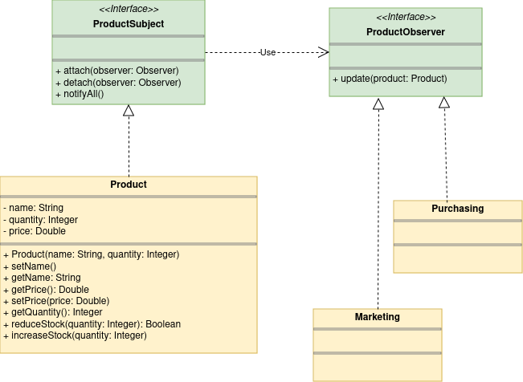

# Lista de produtos

Este projeto faz parte da avaliação diagnóstica da disciplina Desenvolvimento de Software para Web 1, ministrada pelo prof. Ednilson Rossi, no IFSP, Campus Araraquara.

## Objetivo

O objetivo deste projeto é trabalhar o uso de objetos da interface List (java.util.List), compreender e implementar o Design Pattern Observer.

## Enunciado

Implemente um projeto em Java que, de acordo com o diagrama de classes base apresentado, monitore a quantidade em estoque de um produto.

Considerações:

- O objeto produto segue as seguintes regras:
    - Podem observar as alterações do objeto produto qualquer objeto que implemente a interface ProductObserver.
    - A quantidade é sempre maior ou igual a zero, de forma que o método reduceStock() retorna verdadeiro se foi possível reduzir a quantidade integral do argumento do estoque e retorna falso caso a quantidade em estoque seja insuficiente. Destaca-se que a redução de estoque só é atendida integralmente.
    - Sempre que a quantidade de um objeto produto é alterada, todos os observadores são notificados.

- A objeto da classe Marketing analisa se a quantidade do produto e determina de forma automática a política de preço da seguinte forma:
    - Se a quantidade é superior a 100, o preço é reduzido em 10%;
    - Se a quantidade é inferior a 50, o preço é acrecido de 18%
    - O objeto da classe Purchasing é responsável pela compra de produtos, sempre que a quantidade está abaixo de 10 unidades e feita a compra automática de 100 unidades do produto, atualizando o estoque automaticamente.

O sistema implementado deve possuir uma interface simples (console) que permite atualizar compra e venda de pelo menos 3 produtos que são observados pelo setor de vendas e compras.
